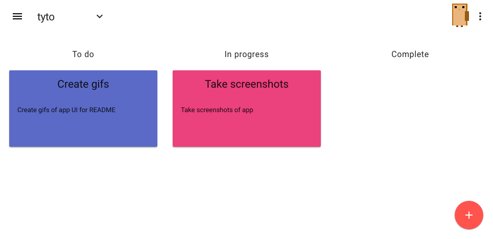

<!--
N.B.: This README was automatically generated by https://github.com/YunoHost/apps/tree/master/tools/readme_generator
It shall NOT be edited by hand.
-->

# Tyto for YunoHost

[](https://dash.yunohost.org/appci/app/tyto)  

[](https://install-app.yunohost.org/?app=tyto)

*[Lire ce readme en français.](./README_fr.md)*

> *This package allows you to install Tyto quickly and simply on a YunoHost server.
If you don't have YunoHost, please consult [the guide](https://yunohost.org/#/install) to learn how to install it.*

## Overview

Tyto is an extensible and customizable management and organisation tool.

**Shipped version:** 3.0.4~ynh2

**Demo:** https://jh3y.github.io/tyto/

## Screenshots



## Documentation and resources

* Official app website: <https://jh3y.github.io/tyto/>
* Upstream app code repository: <https://github.com/jh3y/tyto>
* YunoHost Store: <https://apps.yunohost.org/app/tyto>
* Report a bug: <https://github.com/YunoHost-Apps/tyto_ynh/issues>

## Developer info

Please send your pull request to the [testing branch](https://github.com/YunoHost-Apps/tyto_ynh/tree/testing).

To try the testing branch, please proceed like that.

``` bash
sudo yunohost app install https://github.com/YunoHost-Apps/tyto_ynh/tree/testing --debug
or
sudo yunohost app upgrade tyto -u https://github.com/YunoHost-Apps/tyto_ynh/tree/testing --debug
```

**More info regarding app packaging:** <https://yunohost.org/packaging_apps>